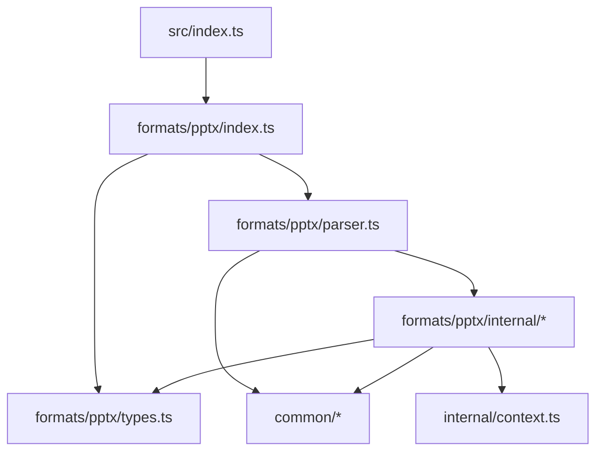
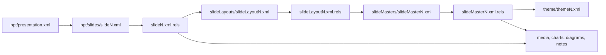
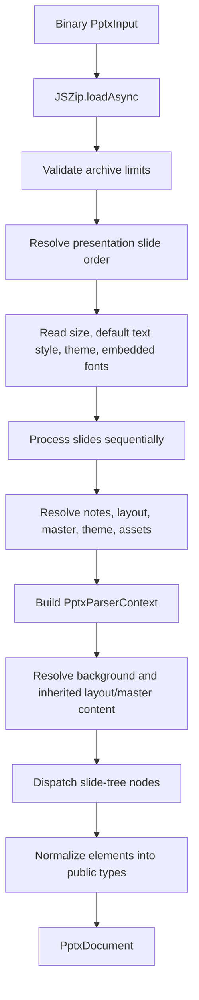

# Architecture

This document describes the architecture implemented by `office2json` today,
the boundaries contributors must preserve, and the intended path from a
PowerPoint reader to a multi-format Office reader/writer library.

The current production path is:

```text
.pptx package -> normalized, typed PowerPoint JSON
```

JSON-to-PowerPoint, Excel, and Word are future capabilities. They are part of
the product direction, not capabilities of the current implementation.

## Design goals

The architecture optimizes for the following goals:

1. **A typed public model.** Consumers should not need to understand OOXML
   namespaces, relationship IDs, EMUs, or package paths.
2. **Fidelity through isolated domain parsers.** Shapes, text, charts, tables,
   media, and other domains can evolve independently from package traversal.
3. **Shared OOXML infrastructure.** Binary, XML, media, text, color, and unit
   primitives should be reusable by future PowerPoint, Excel, and Word code.
4. **Browser and Node.js support.** The public input and output contracts avoid
   filesystem-only APIs.
5. **Graceful handling of optional parts.** Missing layout, theme, notes, or
   style parts should not make an otherwise readable package unusable.
6. **Fixture-driven compatibility.** Every fidelity correction should be tied
   to the smallest reproducible OOXML structure and a public-output assertion.

The current parser does not attempt byte-for-byte preservation, streaming ZIP
processing, schema validation, macro execution, or package repair. “Lossless”
round-tripping is a long-term direction and must not be inferred from the
current normalized reader model.

## System context


The package boundary is deliberately narrow: callers provide binary input and
receive a typed document. Package traversal, XML representation, relationship
maps, caches, and inheritance state remain internal.

## Source layout

```text
src/
├── index.ts                         Root public entry point
├── types/
│   └── txml.d.ts                    Local declaration for the XML dependency
├── common/
│   ├── index.ts                     Shared internal barrel
│   ├── archive/read-entry.ts        Size-bounded ZIP entry expansion
│   ├── binary/base64.ts             Runtime-neutral base64 encoder
│   ├── media/media-type.ts          Extension and MIME helpers
│   ├── ooxml/units.ts               OOXML unit constants
│   ├── opc/part-uri.ts              Relationship target normalization
│   ├── text/css.ts                  Safe CSS value serialization
│   ├── text/html.ts                 HTML escaping and content checks
│   ├── numbers.ts                   Numeric normalization helpers
│   └── xml/
│       ├── read-xml.ts              ZIP part reader and XML simplifier
│       └── tree.ts                  Dynamic path traversal helpers
└── formats/
    └── pptx/
        ├── index.ts                 Public PowerPoint entry point
        ├── types.ts                 Public PowerPoint document model
        ├── parser.ts                Package and slide orchestration
        ├── errors.ts                Typed public parse failures
        └── internal/
            ├── context.ts           Per-slide parser state and caches
            ├── animation.ts         Slide transition parsing
            ├── border.ts            DrawingML line and arrow parsing
            ├── chart.ts             Chart series normalization
            ├── color.ts             OOXML color transformations
            ├── diagram.ts           SmartArt part resolution
            ├── fill.ts              Fill inheritance and media loading
            ├── font-style.ts        Run and theme font resolution
            ├── math.ts              Office Math to LaTeX conversion
            ├── paragraph.ts         Paragraph and autofit resolution
            ├── position.ts          EMU geometry conversion
            ├── resource-limits.ts   Resource defaults and archive checks
            ├── scheme-color.ts      Theme color lookup
            ├── shadow.ts            Outer-shadow normalization
            ├── shape.ts             Custom geometry and shape selection
            ├── shape-path.ts        Preset geometry to SVG path generation
            ├── table.ts             Table style and cell resolution
            ├── text-insets.ts       Text-box inset inheritance
            ├── text.ts              Rich-text HTML generation
            └── xml-reader.ts        Cached, diagnostic-aware part reader
```

Tests live outside `src`:

```text
test/
├── black-box/                       Independent public-API fixtures and fuzzing
├── browser/                         Real Chromium boundary tests
├── common/                          Shared OOXML primitive tests
├── corpus/                          Producer manifest and semantic assertions
└── pptx/                            Parser integration tests
```

## Layering and dependency rules

The dependency direction is part of the architecture:



| Layer                 | May depend on                                     | Must not expose                         |
| --------------------- | ------------------------------------------------- | --------------------------------------- |
| Root API              | Format public entry points                        | Format internals or raw XML             |
| Format public API     | Its parser and public types                       | Parser context or helper implementation |
| Format orchestrator   | Public types, format internals, shared primitives | Raw XML in the returned document        |
| Format internals      | Same-format types/context and shared primitives   | Cross-format assumptions                |
| Shared infrastructure | Runtime dependencies and other shared primitives  | PowerPoint-specific node paths          |

Code belongs in `src/common` only when its contract is independent of a
particular Office format. A helper that knows `p:sp`, `a:txBody`, or slide
inheritance belongs under `formats/pptx`, even if a future Word parser may have
similar needs.

`src/formats/pptx/internal` is not a supported package entry point. Consumers
must import from `office2json` or `office2json/pptx`.

## Public API boundary

The root and format-specific entry points expose the same reader:

```ts
export async function parsePptx(
  input: ArrayBuffer | Uint8Array | Blob,
  options?: PptxParseOptions,
): Promise<PptxDocument>;
```

The public contract consists of:

- the `parsePptx` function;
- `PptxInput` and `PptxParseOptions`;
- the `PptxDocument`, slide, element, fill, and supporting types.

Everything else is an implementation detail. In particular, `XmlLookupValue`,
`PptxParserContext`, relationship maps, and domain-parser functions are not
public stability commitments.

The package is built as ESM and CommonJS with declarations and source maps. The
two export paths are:

```text
office2json       -> dist/index.{js,cjs,d.ts}
office2json/pptx  -> dist/pptx/index.{js,cjs,d.ts}
```

## OOXML package model

A `.pptx` file is an Open Packaging Conventions ZIP archive. Content is split
across parts, and `.rels` files connect one part to another through relationship
IDs. A slide is therefore not self-contained.

A typical dependency chain is:



`[Content_Types].xml` declares which package parts are slides. The visible slide
sequence comes from `p:presentation/p:sldIdLst`; each `r:id` is resolved through
`ppt/_rels/presentation.xml.rels`. This preserves authored reorder operations
and excludes orphan slide parts left in the archive.

Relationship targets are normalized into ZIP-relative `ppt/...` paths.
External relationships retain their URL targets. Relationship IDs are then
stored in source-specific maps for the slide, layout, master, and theme. Keeping
the maps separate prevents the same `rId` value in different parts from being
resolved against the wrong owner.

## Internal XML representation

`common/xml/read-xml.ts` converts an XML part into the compatibility tree used
by the format parsers:

1. the ZIP entry is expanded incrementally with a byte limit;
2. a linear scan enforces XML depth and element-count limits before recursive
   parsing;
3. `txml` parses with whitespace retention enabled;
4. whitespace-only text nodes and the XML declaration are discarded;
5. qualified tag names such as `p:sp` and `a:xfrm` remain unchanged;
6. attributes are stored under `attrs`;
7. repeated sibling tags become arrays, while a single tag is collapsed to a
   single value;
8. a per-read, monotonically increasing `attrs.order` value records document
   traversal order without sharing mutable state across documents.

For example, simplified XML resembles:

```ts
{
  'p:sp': {
    attrs: { order: 42 },
    'p:nvSpPr': {
      'p:cNvPr': {
        attrs: { id: '2', name: 'Title', order: 43 },
      },
    },
  },
}
```

The simplifier is intentionally internal. Singleton collapsing makes dynamic
traversal convenient but does not represent an OOXML schema. `XmlLookupValue`
is an intersection type retained to type a compatibility port without `any`.
New schema-aware code should use explicit local result types and runtime guards
rather than expand that compatibility type.

`readXmlFileResult` preserves `ok`, `missing`, and `error` states. The
PowerPoint XML reader caches those results, converts failures into structured
diagnostics in tolerant mode, and throws `PptxParseError` in strict mode. The
compatibility `readXmlFile` helper still returns `null` for missing or invalid
optional parts. An invalid root ZIP always causes the public promise to reject.

## Parsing pipeline



### 1. Normalize options and open the package

`parse` fills in defaults before reading any content:

```ts
{
  imageMode: 'base64',
  videoMode: 'none',
  audioMode: 'none',
  errorMode: 'tolerant',
  limits: { /* bounded defaults */ },
}
```

Package-wide media caches and an XML-part cache are initialized once per parse
call. Input size is checked before JSZip opens the package. Entry count,
declared per-entry expansion, and declared total expansion are checked before
any part is parsed.

### 2. Read presentation-level metadata

The orchestrator reads:

- slide declarations from `[Content_Types].xml`;
- authored slide order from `p:sldIdLst` and presentation relationships;
- slide width, height, and the default text style from
  `ppt/presentation.xml`;
- the presentation theme through `ppt/_rels/presentation.xml.rels`;
- theme accent colors `accent1` through `accent6`;
- font faces declared by `p:embeddedFontLst`.

OOXML dimensions are stored in English Metric Units. Public dimensions are
converted to points with:

```text
points = EMUs * 72 / 914400
```

The same unit convention is used for document size and positioned elements.

### 3. Resolve the per-slide relationship graph

For every slide, the orchestrator follows this chain:

1. slide relationships locate notes, slide layout, hyperlinks, and assets;
2. layout relationships locate the slide master and layout-owned assets;
3. master relationships locate the theme and master-owned assets;
4. theme relationships locate theme-owned background resources;
5. `ppt/tableStyles.xml` is loaded for table style resolution.

Layout, master, relationship, theme, and table-style XML is cached by filename
across slides. Slide XML is read directly. Image, video, and audio data is
cached by normalized package path across the entire parse call.

### 4. Build parser context

`PptxParserContext` is the internal dependency container passed to domain
parsers. Its responsibilities are grouped below:

| Context data            | Purpose                                                   |
| ----------------------- | --------------------------------------------------------- |
| `zip`                   | Access binary and XML package parts.                      |
| `options`               | Apply media representation policy.                        |
| `slideContent`          | Resolve authored slide nodes.                             |
| `slideLayoutContent`    | Resolve placeholders and inherited elements.              |
| `slideMasterContent`    | Resolve master geometry, styles, and color maps.          |
| `themeContent`          | Resolve scheme colors, fonts, and background fill styles. |
| relationship maps       | Resolve IDs in the correct owning part.                   |
| layout/master indexes   | Match placeholders by ID, index, or type.                 |
| media caches            | Avoid encoding the same package media more than once.     |
| XML/diagram caches      | Avoid repeated parsing of shared supporting parts.        |
| default and master text | Complete the text-style inheritance chain.                |

The context is internal by design. Passing one object avoids wide argument
lists, but it must not become the public document model.

### 5. Resolve inheritance

PowerPoint values can be defined at several levels. Resolution is local to the
domain that owns the value, but the common precedence is the most specific
source first:

```text
slide -> layout placeholder -> master placeholder -> theme/default
```

Important implemented cases include:

- **geometry:** a shape's `a:off` and `a:ext` fall back from slide to layout to
  master;
- **placeholders:** layout and master nodes are indexed by placeholder ID,
  `idx`, and type so inherited values can be matched;
- **background:** explicit slide background, then layout, then master; a
  `p:bgRef` can resolve a theme background fill; white is the final fallback;
- **shape fill:** direct fill, group hierarchy, layout/master placeholder, then
  style/theme references as supported by the fill parser;
- **text:** paragraph and run properties resolve through placeholder, master,
  theme, and presentation defaults;
- **transition:** slide, then layout, then master;
- **layout decoration:** non-placeholder layout shapes are emitted, followed by
  non-placeholder master shapes unless `showMasterSp="0"`.

Inherited decorative elements are returned as `slide.layoutElements` instead
of being merged into `slide.elements`. This preserves provenance for renderers
that need to hide, style, or order background content separately.

### 6. Dispatch slide nodes

`processNodesInSlide` is the central DrawingML dispatcher:

| OOXML node            | Parser path                   | Public result                  |
| --------------------- | ----------------------------- | ------------------------------ |
| `p:sp`                | shape/text parser             | `Shape` or `Text`              |
| `p:cxnSp`             | connector parser              | `Shape` or `Text`              |
| `p:pic`               | picture/media parser          | `Image`, `Video`, or `Audio`   |
| `p:graphicFrame`      | graphic-frame parser          | `Table`, `Chart`, or `Diagram` |
| `p:grpSp`             | recursive group parser        | `Group`                        |
| `mc:AlternateContent` | fallback group or math parser | `Group` or `Math`              |

Unknown nodes are skipped. Supported nodes receive their non-visual OOXML ID;
`attrs.order` is copied to the public `order` field so consumers can reconstruct
document order where needed.

### 7. Normalize domain content

Domain parsers translate OOXML-specific structures into renderer-oriented
values:

- colors become hexadecimal strings after supported tint, shade, luminance,
  hue, and saturation transforms;
- rich text becomes HTML with run and paragraph styling;
- font families are serialized as quoted CSS strings and DrawingML colors are
  accepted only as RGB/RGBA hexadecimal values;
- preset and custom geometry becomes SVG-compatible path data and view boxes;
- Office Math becomes LaTeX, with the fallback image retained when present;
- table styles become cell-level fills, fonts, borders, merges, and dimensions;
- chart caches become normalized series, category labels, and supported chart
  options;
- SmartArt exposes both rendered shape/text elements and its logical text list;
- group children are transformed into their parent coordinate space.

This is a semantic normalization boundary, not a reversible OOXML abstract
syntax tree. Information without a public-model field may be omitted.

## Public document invariants

Consumers can rely on these current conventions:

- coordinates and dimensions use points;
- rotations use degrees;
- element unions are discriminated by `type`;
- colors are normally CSS-compatible hexadecimal strings;
- text and note payloads are HTML fragments;
- shape paths are intended for SVG rendering;
- math payloads use LaTeX;
- missing optional string representations such as disabled media output use an
  empty string in the current compatibility model;
- nested groups contain recursively normalized `Element[]` values;
- slide-authored and inherited layout/master elements remain separate.

Some existing public property names, including compatibility spellings such as
`shapType`, are part of the pre-stable model. Correcting them requires an
explicit migration plan; contributors must not silently rename them while
working on unrelated fidelity changes.

## Media handling and ownership

Media policy is selected at the public API boundary:

| Media | Modes                            | Default  |
| ----- | -------------------------------- | -------- |
| Image | `base64`, `blob`, `both`, `none` | `base64` |
| Video | `blob`, `none`                   | `none`   |
| Audio | `blob`, `none`                   | `none`   |

The parser always preserves `ref` when it can resolve a package part or
external target. For selected binary representations:

- `base64` reads the ZIP part as an `ArrayBuffer` and returns a MIME-prefixed
  data URL;
- `blob` creates a `Blob` and returns `URL.createObjectURL(blob)`;
- package media is cached by normalized path and representation.

Object URLs are runtime resources, not owned by the parser after return. The
consumer must call `URL.revokeObjectURL` when the document is discarded.
Base64 avoids lifecycle management but increases memory use and JSON size.

No media is executed by the parser. External video URLs are preserved as
references. The current parser recognizes a limited set of common embedded
video and audio extensions.

## Error handling and recovery

The implementation distinguishes package failure from optional-part failure:

- invalid or unsupported ZIP input rejects `parsePptx`;
- a missing optional XML part resolves to an empty internal node;
- unreadable or invalid XML emits a diagnostic in tolerant mode;
- strict mode throws `PptxParseError` for malformed XML, unsafe relationship
  targets, and missing required parts;
- resource-limit violations throw `PptxParseError` in both tolerant and strict
  modes;
- missing relationships generally cause the affected element or feature to be
  skipped;
- an unsupported slide-tree node is ignored;
- missing backgrounds fall back to white;
- missing positions and dimensions fall back to zero.

`parsePptxWithDiagnostics` returns `{ document, diagnostics }` so recovery is
observable without logging from internal helpers. Repeated reads of the same
failed part emit one diagnostic per parse call.

## Security boundaries

Office files must be treated as untrusted structured archives.

The parser currently:

- does not execute macros or embedded scripts;
- does not fetch external relationships;
- escapes supported rich-text and speaker-note paths;
- allows only HTTP, HTTPS, and mailto hyperlinks in generated HTML;
- quotes untrusted font-family values and validates CSS color values;
- bounds compressed input, entry count, declared archive expansion, individual
  parts, XML bytes/depth/per-part and cumulative node counts, embedded media,
  and slide count;
- stops XML and media decompression when an entry crosses its byte limit, even
  when ZIP metadata understated the expanded size;
- does not provide an in-process wall-clock timeout;
- still expects consumers to sanitize returned HTML as defense in depth.

An upload service should still enforce a wall-clock timeout around an isolated
worker or process. Browser or server consumers should sanitize returned HTML
according to their rendering context. Callers can tighten resource limits for
their deployment without changing domain parsers.

## Performance characteristics

Current behavior favors simple, deterministic parsing:

- JSZip opens the archive in memory, while XML and media entries are expanded
  through bounded readers;
- slides are processed sequentially;
- shared XML parts are cached by filename;
- media encoding and object-URL creation are cached by package path;
- layout/master indexes avoid repeated placeholder-tree scans;
- diagram supporting parts use a local cache;
- the complete public document is retained until parsing finishes.

Memory cost therefore grows with the archive and selected media mode. `both`
is the most expensive image mode because it retains both data URLs and object
URLs. A future streaming or lazy-media API would require a new public ownership
model and should not be hidden behind the existing `parsePptx` signature.

Parallel slide parsing is not currently safe to assume. Shared caches and the
document-order compatibility field would need explicit concurrency semantics
before that change.

## Build and runtime architecture

The package targets ES2022 and supports ESM and CommonJS. `tsup` creates two
entry points, declarations, and source maps. The compiler enables strict mode,
`noUncheckedIndexedAccess`, `exactOptionalPropertyTypes`, isolated modules, and
case-consistency checks.

Runtime dependencies have narrow roles:

| Dependency   | Responsibility                            |
| ------------ | ----------------------------------------- |
| `jszip`      | Open OPC archives and read package parts. |
| `txml`       | Parse OOXML strings into a lossless tree. |
| `tinycolor2` | Apply supported color transformations.    |

Strict compiler and lint settings are architecture constraints. Compatibility
work should add local guards and explicit types rather than disable rules or
widen the project to `any`.

## Testing strategy

The primary test style is an integration fixture assembled as an in-memory ZIP:

```text
create minimal OOXML parts
        -> generate Uint8Array
        -> parsePptx
        -> assert public model
```

This approach has several advantages:

- the relevant OOXML is visible in the test;
- fixtures remain small and reviewable;
- no binary document needs to be regenerated for a one-node correction;
- tests verify the public contract rather than private helper behavior.

Add a binary fixture only when the behavior cannot be represented reliably as
a small package or when compatibility with a real producer is itself the test.
Keep binary fixtures minimal and document their origin and expected feature.

Reliability is split into four gates with different cost and purpose:

| Gate             | Detects                                                           |
| ---------------- | ----------------------------------------------------------------- |
| Fast Vitest      | Regressions and seeded ZIP/XML/path/number properties             |
| Browser Vitest   | Browser `Blob`, object-URL, bundling, and runtime incompatibility |
| Producer corpus  | PowerPoint, LibreOffice, and Google Slides compatibility          |
| Mutation testing | Assertions that execute code but fail to distinguish bad logic    |

The producer corpus is downloaded into an ignored cache. Stable files are
pinned by whole-file SHA-256. Google Slides reconstructs exported ZIP/media
parts on every request, so its entry pins an ordered slide-text SHA-256 and a
maximum download size. The corpus asserts both structural invariants and
minimum semantic element counts; merely returning an empty document cannot
pass it.

The mutation gate targets shared archive, XML, relationship, text-sanitization,
and resource-limit boundaries. Its report is retained as a CI artifact so
surviving mutants can be converted into focused public-contract tests.

Every change must pass:

```bash
pnpm check
```

That command checks formatting, type-aware linting, strict TypeScript, Vitest,
and both package builds on Node.js 20, 22, and 24. Chromium, producer-corpus,
and mutation gates have dedicated commands because they require external
runtimes or are intentionally slower.

## Adding PowerPoint fidelity

Use this sequence for a new PowerPoint feature or bug fix:

1. Reduce the document to the smallest OOXML package that still demonstrates
   the behavior.
2. Decide whether the result fits the current public model. If not, design the
   type change before changing parser internals.
3. Identify the owning domain module. Keep package traversal in `parser.ts` and
   domain logic in `internal/*`.
4. Add only reusable, format-neutral primitives to `common`.
5. Resolve relationship targets through the map owned by the source part.
6. Apply inheritance from most specific to least specific and include an
   explicit fallback.
7. Return normalized values; do not leak raw XML nodes or relationship IDs.
8. Assert the public output with a focused fixture.
9. Run `pnpm check` and inspect generated declaration output when public types
   changed.

When adding a new element kind, update all of the following together:

- the discriminated union in `formats/pptx/types.ts`;
- the relevant node-dispatch path in `parser.ts`;
- the owning internal domain parser;
- public documentation and a fixture test;
- consumer traversal examples if the element can contain nested media.

## Adding another Office format

Excel and Word should be sibling format packages, not branches inside the
PowerPoint parser:

```text
src/formats/
├── pptx/
├── xlsx/
│   ├── index.ts
│   ├── parser.ts
│   ├── types.ts
│   └── internal/
└── docx/
    ├── index.ts
    ├── parser.ts
    ├── types.ts
    └── internal/
```

Each format owns its public model, orchestrator, inheritance rules, and domain
parsers. Shared OPC path handling, relationship primitives, XML reading, units,
binary conversion, and genuinely cross-format DrawingML behavior can migrate
into `common` after a second concrete use case proves the abstraction.

Do not generalize a PowerPoint helper speculatively. Similar OOXML tag names do
not guarantee the same inheritance or package ownership semantics in another
format.

The root API can re-export new format entry points, while subpath exports keep
format-only consumers isolated:

```text
office2json/pptx
office2json/xlsx    (future)
office2json/docx    (future)
```

## Reader and writer separation

A future JSON-to-Office writer should not reverse the current parser function
step by step. Reading is tolerant and normalizing; writing must be strict and
package-valid.

The expected format architecture is:

```text
format public API
├── reader orchestration
├── writer orchestration
├── public semantic model
└── shared format-domain rules
```

A writer will need explicit decisions for IDs, relationship allocation,
content types, XML serialization, unsupported fields, media ownership, and
package validation. If exact round-trip preservation becomes a requirement, it
will also need an extension mechanism for source XML that the normalized model
does not represent today.

## Stability and migration policy

The package is currently `0.0.0`, so the public model is pre-stable. Even during
this phase, changes should be deliberate:

- prefer additive optional fields for new fidelity;
- accompany renamed or corrected fields with a documented migration;
- keep raw OOXML details internal unless consumers genuinely need them;
- distinguish “unsupported” from a valid zero, empty string, or `null`;
- update README examples, exported declarations, and fixtures with public API
  changes.

Architecture evolves when implementation evidence requires it. This document
should be updated in the same change whenever a package boundary, pipeline
phase, ownership rule, cache lifetime, or public invariant changes.
