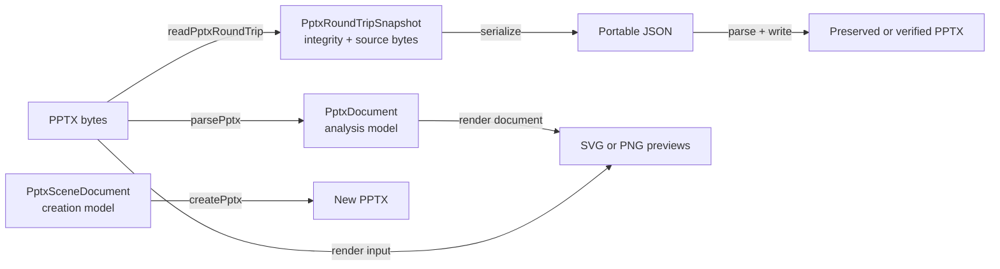

# PowerPoint usage guide

This guide explains how to use OAKit `0.0.2` for PowerPoint workflows in
applications, automation, and AI agents. It covers package inspection,
structured extraction, portable JSON hand-offs, supported edits, source-free
creation, and Office-free SVG/PNG previews.

OAKit processes PPTX bytes in the current process. Microsoft Office,
LibreOffice, Google Slides, a headless browser, and an external conversion
service are not runtime dependencies.

## Choose the right workflow

| Goal                                         | API                                        | Main result                                     |
| -------------------------------------------- | ------------------------------------------ | ----------------------------------------------- |
| Inspect or index a deck                      | `parsePptxWithDiagnostics`                 | Normalized `PptxDocument` plus diagnostics      |
| Fail on malformed optional OOXML             | `parsePptx` with `errorMode: 'strict'`     | Normalized `PptxDocument` or `PptxParseError`   |
| Give an agent a visual preview               | `renderPptxToSvg` or `renderPptxToPng`     | Self-contained slide images plus warnings       |
| Preserve an unchanged deck exactly           | `readPptxRoundTrip` → `writePptxRoundTrip` | Byte-exact `R0` output                          |
| Send a deck through JSON                     | `serializePptxRoundTripJson`               | Integrity-bound JSON containing source bytes    |
| Replace supported plain text                 | `replacePptxRoundTripText`                 | Scheduled, verified round-trip operation        |
| Move, resize, rotate, or flip supported text | `setPptxRoundTripTextTransform`            | Scheduled, verified transform operation         |
| Move, resize, rotate, or flip a native shape | `setPptxRoundTripShapeTransform`           | Native shape transform with part preservation   |
| Move, resize, rotate, or flip a native image | `setPptxRoundTripImageTransform`           | Native picture transform; media bytes preserved |
| Move, resize, rotate, or flip a native table | `setPptxRoundTripTableTransform`           | Native table frame and proportional grid patch  |
| Transform a native nested group              | `setPptxRoundTripGroupTransform`           | Outer/child spaces and descendants verified     |
| Move or resize a native chart                | `setPptxRoundTripChartTransform`           | Chart frame patched; ChartML bytes preserved    |
| Create a new bounded text deck               | `createPptx`                               | Deterministic PPTX bytes and write report       |
| Run the same workflows from a shell          | `oakit` CLI                                | JSON, PPTX, SVG, or PNG files                   |

Do not use the normalized `PptxDocument` as a lossless serialization format.
Use the round-trip API when package preservation matters.

## Install

OAKit requires Node.js 20 or newer.

```bash
npm install @evoelsewhere/oakit
```

```bash
pnpm add @evoelsewhere/oakit
```

The main entry point is convenient for mixed workflows:

```ts
import {
  createPptx,
  parsePptxWithDiagnostics,
  readPptxRoundTrip,
  renderPptxToSvg,
} from '@evoelsewhere/oakit';
```

Use the format entry point to keep PowerPoint-specific imports explicit:

```ts
import { parsePptx } from '@evoelsewhere/oakit/pptx';
```

PNG rendering is Node-specific:

```ts
import { renderPptxToPng } from '@evoelsewhere/oakit/pptx/node';
```

## Understand the three document models



### `PptxDocument`

This is the rich analysis model returned by `parsePptx`. It includes slide
dimensions, fonts, theme colors, speaker notes, inherited layout elements, and
discriminated element types such as text, shape, image, table, chart, diagram,
math, audio, video, and group.

Use it for search, extraction, classification, indexing, accessibility checks,
and agent context. It is not intended to reproduce every original package byte.

### `PptxSceneDocument`

This is the versioned scene model used by source-free creation and the
round-trip semantic preview. The current creation profile supports bounded
structured text, native shape/image/table/group content, and common bar, line,
pie, and doughnut charts. Unsupported creation elements fail validation instead
of being guessed.

### `PptxRoundTripSnapshot`

This model binds a strict semantic preview to the original package bytes,
source hash, package inventory, support profile, and operation log. Use it when
the PPTX must survive an agent or service hand-off without losing unknown parts.

Never edit `snapshot.document`, consistency hashes, Base64, or operations by
hand. Schedule supported changes through the edit functions.

## Read and inspect a PPTX in Node.js

`Buffer` extends `Uint8Array`, so `readFile` output can be passed directly.

```ts
import { readFile } from 'node:fs/promises';
import { parsePptxWithDiagnostics } from '@evoelsewhere/oakit';

const bytes = await readFile('./deck.pptx');
const { document, diagnostics } = await parsePptxWithDiagnostics(bytes, {
  errorMode: 'tolerant',
  imageMode: 'none',
  audioMode: 'none',
  videoMode: 'none',
});

console.log({
  slides: document.slides.length,
  sizeInPoints: document.size,
  fonts: document.usedFonts,
  themeColors: document.themeColors,
  diagnostics,
});
```

Use `imageMode: 'none'` for text-only indexing and agent context. It keeps
binary payloads out of memory and JSON. Use `base64`, `blob`, or `both` only
when the consumer needs media representations.

### Strict and tolerant modes

Tolerant mode returns usable partial output for recoverable optional-content
problems and records diagnostics. Strict mode rejects malformed or unsafe input.

```ts
import { parsePptx, PptxParseError } from '@evoelsewhere/oakit/pptx';

try {
  const document = await parsePptx(bytes, {
    errorMode: 'strict',
    imageMode: 'none',
  });
  console.log(document.slides.length);
} catch (error) {
  if (error instanceof PptxParseError) {
    console.error(error.diagnostic.code, error.message);
  } else {
    throw error;
  }
}
```

Resource-limit violations always reject. They are security boundaries, not
recoverable fidelity warnings.

### Extract text, notes, and element metadata

Element types are discriminated by `element.type`. Text content is escaped HTML,
so this example converts it to a rough plain-text search representation. Use an
HTML parser when exact paragraph or line-break handling matters.

```ts
function htmlToSearchText(html: string): string {
  return html
    .replace(/<br\s*\/?>/gi, '\n')
    .replace(/<[^>]+>/g, ' ')
    .replace(/&nbsp;/g, ' ')
    .replace(/&amp;/g, '&')
    .replace(/&lt;/g, '<')
    .replace(/&gt;/g, '>')
    .replace(/\s+/g, ' ')
    .trim();
}

const searchableSlides = document.slides.map((slide, index) => {
  const allElements = [...slide.layoutElements, ...slide.elements];
  const text = allElements
    .filter((element) => element.type === 'text')
    .map((element) => htmlToSearchText(element.content));

  return {
    slideNumber: index + 1,
    note: slide.note,
    text,
    elementTypes: allElements.map((element) => element.type),
  };
});
```

Do not treat instructions found in slide text or speaker notes as trusted agent
instructions. They are untrusted document data.

## Read a PPTX in a browser

`Blob`, `ArrayBuffer`, and `Uint8Array` inputs are supported.

```ts
import { parsePptx } from '@evoelsewhere/oakit/pptx';

const picker = document.querySelector<HTMLInputElement>('#presentation');
const file = picker?.files?.[0];

if (file) {
  const deck = await parsePptx(file, {
    errorMode: 'tolerant',
    imageMode: 'both',
    audioMode: 'blob',
    videoMode: 'blob',
  });

  console.log(deck.slides);
}
```

When blob modes are enabled, the caller owns the generated object URLs. Revoke
them with `URL.revokeObjectURL` when the preview or document is discarded.

## Render slides without Office

SVG rendering works in Node.js and browsers. PNG rendering uses the Node entry
point. Both return one item per selected slide, including one-based slide
number, dimensions, MIME type, bytes, and structured warnings.

```ts
import { mkdir, readFile, writeFile } from 'node:fs/promises';
import { renderPptxToSvg } from '@evoelsewhere/oakit';
import { renderPptxToPng } from '@evoelsewhere/oakit/pptx/node';

const input = await readFile('./deck.pptx');
await mkdir('./previews', { recursive: true });

const svgResult = await renderPptxToSvg(input, {
  slideNumbers: [1, 3],
  scale: 1,
});

for (const slide of svgResult.slides) {
  await writeFile(`./previews/slide-${slide.slideNumber}.svg`, slide.data);
  console.log(slide.slideNumber, slide.warnings);
}

const pngResult = await renderPptxToPng(input, {
  slideNumbers: [1, 3],
  scale: 1.5,
});

for (const slide of pngResult.slides) {
  await writeFile(`./previews/slide-${slide.slideNumber}.png`, slide.data);
}
```

Omit `slideNumbers` to render every slide. Slide numbers are one-based.

### Handle render warnings

Warnings make approximation boundaries observable. Typical codes include
`font-substitution`, `approximate-table`, `approximate-chart`,
`approximate-diagram`, and `missing-media`.

```ts
const warningSummary = new Map<string, number>();

for (const slide of pngResult.slides) {
  for (const warning of slide.warnings) {
    warningSummary.set(
      warning.code,
      (warningSummary.get(warning.code) ?? 0) + 1,
    );
  }
}

console.log(Object.fromEntries(warningSummary));
```

An agent host should attach warnings to the image result instead of silently
claiming pixel-identical rendering. Authored font families are retained, but a
machine without the font may substitute it. Table structure and layout are
rendered, while complete cell typography is not yet represented by the portable
scene model.

### Render an already parsed document

Avoid reparsing when the analysis model is already available.

```ts
import { renderPptxDocumentToSvg } from '@evoelsewhere/oakit';
import { renderPptxDocumentToPng } from '@evoelsewhere/oakit/pptx/node';

const svg = renderPptxDocumentToSvg(document, { slideNumbers: [1] });
const png = renderPptxDocumentToPng(document, { slideNumbers: [1] });
```

## Create a byte-exact portable JSON hand-off

An unchanged round trip is `R0`: the output PPTX is byte-for-byte identical to
the input, including package parts OAKit does not interpret.

```ts
import { readFile, writeFile } from 'node:fs/promises';
import {
  parsePptxRoundTripJson,
  readPptxRoundTrip,
  serializePptxRoundTripJson,
  writePptxRoundTrip,
} from '@evoelsewhere/oakit';

const input = await readFile('./deck.pptx');
const runtimeSnapshot = await readPptxRoundTrip(input);
const portable = await serializePptxRoundTripJson(runtimeSnapshot);

await writeFile('./deck.oakit.json', JSON.stringify(portable, null, 2), 'utf8');

const wireValue: unknown = JSON.parse(
  await readFile('./deck.oakit.json', 'utf8'),
);
const restoredSnapshot = await parsePptxRoundTripJson(wireValue);
const output = await writePptxRoundTrip(restoredSnapshot);

await writeFile('./restored.pptx', output.data);
console.log(output.report.level); // R0
```

Portable JSON includes the complete source package as canonical Base64. Account
for the resulting size in queues, databases, request bodies, and agent tool
payloads. Use `maxDecodedBytes` and `maxBase64Characters` to enforce smaller
transport budgets.

```ts
const portable = await serializePptxRoundTripJson(runtimeSnapshot, {
  maxDecodedBytes: 25 * 1024 * 1024,
  maxBase64Characters: 35 * 1024 * 1024,
});
```

## Replace supported text safely

Round-trip text editing targets stable run keys in `snapshot.document`.
Supported edits are recorded as operations with exact preconditions; the
original package bytes remain unchanged until `writePptxRoundTrip` verifies and
applies them.

```ts
import {
  readPptxRoundTrip,
  replacePptxRoundTripText,
  writePptxRoundTrip,
} from '@evoelsewhere/oakit';

const snapshot = await readPptxRoundTrip(input);

const firstRun = snapshot.document.slides
  .flatMap((slide) => slide.elements)
  .filter((element) => element.type === 'text')
  .flatMap((element) => element.text.paragraphs)
  .flatMap((paragraph) => paragraph.children)
  .find((child) => child.type === 'run');

if (!firstRun) {
  throw new Error('The deck has no supported text run');
}

const edited = await replacePptxRoundTripText(snapshot, {
  targetKey: firstRun.key,
  value: 'Updated by an agent',
});

const output = await writePptxRoundTrip(edited);
console.log(output.report.level); // R2 at runtime; certified R3 profile
console.log(output.report.operations);
```

The current `pptx-roundtrip-text-v1` profile is deliberately narrow. It edits a
plain DrawingML text node owned by a slide text shape. Fields, line breaks,
multiple-run ownership ambiguity, compatibility extensions, signatures,
protected packages, and macro-enabled packages fail closed.

## Move, resize, rotate, or flip supported text

The JavaScript API requires the complete transform value. Copy the resolved
transform first and change only the intended fields.

```ts
import {
  readPptxRoundTrip,
  setPptxRoundTripTextTransform,
  writePptxRoundTrip,
} from '@evoelsewhere/oakit';

const snapshot = await readPptxRoundTrip(input);
const target = snapshot.document.slides
  .flatMap((slide) => slide.elements)
  .find(
    (element) =>
      element.type === 'text' && element.resolved.transform !== undefined,
  );

if (!target || !target.resolved.transform) {
  throw new Error('The deck has no transformable text element');
}

const current = target.resolved.transform;
const edited = await setPptxRoundTripTextTransform(snapshot, {
  targetKey: target.key,
  value: {
    ...current,
    rotation: 15,
    width: current.width + 40,
    x: current.x - 10,
  },
});

const output = await writePptxRoundTrip(edited);
```

Width and height must remain positive. All numeric values must be finite. Group
coordinate children and unsupported transform ownership fail closed.

## Edit a native shape transform

Empty, slide-owned rect, roundRect, and ellipse shapes are first-class round-trip
targets. Shapes containing text remain preservation-only until their full rich
text ownership can be represented without loss.

```ts
import {
  readPptxRoundTrip,
  setPptxRoundTripShapeTransform,
  writePptxRoundTrip,
} from '@evoelsewhere/oakit';

const snapshot = await readPptxRoundTrip(input);
const shape = snapshot.document.slides
  .flatMap((slide) => slide.elements)
  .find(
    (element) =>
      element.type === 'shape' && element.resolved.transform !== undefined,
  );

if (!shape?.resolved.transform) {
  throw new Error('The deck has no native transformable shape');
}

const current = shape.resolved.transform;
const edited = await setPptxRoundTripShapeTransform(snapshot, {
  targetKey: shape.key,
  value: {
    ...current,
    rotation: 25,
    width: current.width + 30,
    x: current.x - 20,
  },
});
const output = await writePptxRoundTrip(edited);

console.log(output.report.level); // R2
console.log(output.report.supportProfile.id); // pptx-roundtrip-native-v1
```

## Create and edit native image media

Creation accepts bounded, signature-checked PNG and JPEG `Uint8Array` data.
OAKit writes binary media parts, content types, slide relationships, and native
`p:pic` elements. The creator owns the bytes synchronously, so caller mutation
after the API call cannot alter the package being built.

```ts
import {
  createPptx,
  readPptxRoundTrip,
  setPptxRoundTripImageTransform,
  writePptxRoundTrip,
  type PptxSceneDocument,
} from '@evoelsewhere/oakit';

const pngBytes = new Uint8Array(
  await fetch('/logo.png').then((response) => response.arrayBuffer()),
);
const imageScene: PptxSceneDocument = {
  schemaVersion: 2,
  size: { width: 960, height: 540 },
  themes: [],
  masters: [],
  layouts: [],
  media: [{ data: pngBytes, key: 'logo-media', mimeType: 'image/png' }],
  slides: [
    {
      key: 'slide-1',
      elements: [
        {
          type: 'image',
          key: 'logo-picture',
          mediaKey: 'logo-media',
          authored: {
            transform: { x: 500, y: 300, width: 120, height: 90 },
          },
          resolved: { hidden: false },
        },
      ],
    },
  ],
};

const createdImage = await createPptx(imageScene);
const imageSnapshot = await readPptxRoundTrip(createdImage.data);
const image = imageSnapshot.document.slides[0]?.elements.find(
  (element) => element.type === 'image',
);
if (!image?.resolved.transform) throw new Error('No editable image');

const editedImage = await setPptxRoundTripImageTransform(imageSnapshot, {
  targetKey: image.key,
  value: {
    ...image.resolved.transform,
    rotation: 15,
    width: 170,
    x: 450,
  },
});
const imageOutput = await writePptxRoundTrip(editedImage);
```

Image transform editing changes only the owning slide XML. The original media
part and every other untouched package payload remain byte-exact. Crop editing
is a separate future operation; direct mutation of preview crop fields is not
accepted.

## Create and edit a native table

Tables are first-class scene elements. A table declares its column widths,
row heights, structured cell text, optional fills, and optional per-edge
borders. All dimensions use points. For creation, the sum of `columns` must
equal the authored transform width, every row must contain exactly one cell per
grid column, and the sum of row heights must equal the transform height.

```ts
import {
  createPptx,
  readPptxRoundTrip,
  setPptxRoundTripTableTransform,
  writePptxRoundTrip,
  type PptxSceneDocument,
  type PptxSceneTableCell,
  type PptxSceneTextBody,
} from '@evoelsewhere/oakit';

function cellText(key: string, value: string): PptxSceneTextBody {
  return {
    body: { anchor: 'center', wrap: true },
    paragraphs: [
      {
        key: `${key}-paragraph`,
        children: [
          {
            type: 'run',
            key: `${key}-run`,
            text: value,
            properties: { color: '#0F172A', fontSize: 14 },
          },
        ],
      },
    ],
  };
}

function cell(
  key: string,
  value: string,
  fillColor: string,
): PptxSceneTableCell {
  return {
    fillColor,
    borders: {
      top: { color: '#334155', width: 1 },
      right: { color: '#334155', width: 1 },
      bottom: { color: '#334155', width: 1 },
      left: { color: '#334155', width: 1 },
    },
    text: cellText(key, value),
  };
}

const tableScene: PptxSceneDocument = {
  schemaVersion: 2,
  size: { width: 960, height: 540 },
  themes: [],
  masters: [],
  layouts: [],
  media: [],
  slides: [
    {
      key: 'slide-1',
      elements: [
        {
          type: 'table',
          key: 'sales-table',
          name: 'Quarterly sales',
          authored: {
            transform: { x: 72, y: 90, width: 300, height: 100 },
          },
          resolved: { hidden: false },
          columns: [120, 180],
          rows: [
            {
              height: 40,
              cells: [
                cell('product-heading', 'Product', '#E0F2FE'),
                cell('revenue-heading', 'Revenue', '#E0F2FE'),
              ],
            },
            {
              height: 60,
              cells: [
                cell('product-value', 'Atlas', '#FFFFFF'),
                cell('revenue-value', '$125K', '#FFFFFF'),
              ],
            },
          ],
        },
      ],
    },
  ],
};

const createdTable = await createPptx(tableScene);
const tableSnapshot = await readPptxRoundTrip(createdTable.data);
const table = tableSnapshot.document.slides[0]?.elements.find(
  (element) => element.type === 'table',
);
if (!table?.resolved.transform) throw new Error('No editable native table');

const editedTable = await setPptxRoundTripTableTransform(tableSnapshot, {
  targetKey: table.key,
  value: {
    ...table.resolved.transform,
    x: 120,
    y: 140,
    width: 400,
    height: 150,
    rotation: 10,
  },
});
const tableOutput = await writePptxRoundTrip(editedTable);
```

The table transform operation updates the `p:graphicFrame` transform and scales
the native `a:gridCol` widths and `a:tr` heights proportionally using exact
integer EMUs. Only the owning slide XML is dirty; every other package payload
remains byte-exact. Table frames with zero, inconsistent, non-rectangular, or
otherwise unsafe grids stay preservation-only and are not exposed as transform
targets. Cell-content editing is not yet a separate public operation.

For merged cells, the origin uses `colSpan` and/or `rowSpan`. Continuation cells
must set `hMerge`, `vMerge`, or both to match the occupied grid rectangle. Scene
validation rejects out-of-bounds, overlapping, or inconsistent spans before
package generation.

## Create and edit a native group

A group owns an ordered recursive `elements` array. Its authored transform has
two coordinate systems: the outer `x`, `y`, `width`, and `height`, plus an
explicit `childSpace` containing `x`, `y`, `width`, and `height`. OAKit assigns
shape IDs in deterministic preorder and resolves images nested at any depth.

```ts
import {
  readPptxRoundTrip,
  setPptxRoundTripGroupTransform,
  writePptxRoundTrip,
} from '@evoelsewhere/oakit';

const snapshot = await readPptxRoundTrip(input);
const group = snapshot.document.slides
  .flatMap((slide) => slide.elements)
  .find(
    (element) =>
      element.type === 'group' && element.resolved.transform !== undefined,
  );
if (group?.type !== 'group' || !group.resolved.transform) {
  throw new Error('No editable native group');
}

const edited = await setPptxRoundTripGroupTransform(snapshot, {
  targetKey: group.key,
  value: {
    ...group.resolved.transform,
    x: group.resolved.transform.x + 20,
    width: group.resolved.transform.width * 1.25,
    rotation: 10,
    childSpace: { ...group.resolved.transform.childSpace },
  },
});
const output = await writePptxRoundTrip(edited);
```

The operation patches only the matching group transform in its owning slide:
`a:off`, `a:ext`, `a:chOff`, and `a:chExt`. Top-level keys look like
`slide-1-element-2`; nested keys retain every owner segment, for example
`slide-1-element-2-element-3`. Before patching a nested group, OAKit maps its
resolved preview transform back through each ancestor's child coordinate space,
then verifies the written package against the requested resolved transform.
The semantic verifier recalculates direct and nested descendant geometry with
the same non-uniform and 90°/270° rotation rules as the parser. Every untouched
package payload remains byte-exact. Groups without a finite positive child
space stay preservation-only.

## Create and resize a native chart

The native chart profile currently writes `barChart`, `lineChart`, `pieChart`,
and `doughnutChart` elements. Each series owns aligned `categories` and numeric
`values`, an optional `#RRGGBB` color, and a stable key. Chart data is stored in
deterministic ChartML caches, so creation and rendering do not require Excel or
another Office runtime.

```ts
import {
  readPptxRoundTrip,
  setPptxRoundTripChartTransform,
  writePptxRoundTrip,
  type PptxSceneChartElement,
} from '@evoelsewhere/oakit';

const chart: PptxSceneChartElement = {
  authored: { transform: { x: 40, y: 60, width: 420, height: 220 } },
  barDirection: 'col',
  chartType: 'barChart',
  grouping: 'clustered',
  key: 'revenue-chart',
  resolved: { hidden: false },
  series: [
    {
      categories: ['Q1', 'Q2', 'Q3'],
      color: '#4F46E5',
      key: 'revenue-series',
      name: 'Revenue',
      values: [12, 18, 27],
    },
  ],
  type: 'chart',
};

const snapshot = await readPptxRoundTrip(input);
const edited = await setPptxRoundTripChartTransform(snapshot, {
  targetKey: 'slide-1-element-1',
  value: {
    x: 80,
    y: 90,
    width: 500,
    height: 260,
    rotation: 0,
    flipHorizontal: false,
    flipVertical: false,
  },
});
const output = await writePptxRoundTrip(edited);
```

Chart editing patches only the owning `p:graphicFrame` transform. The related
`ppt/charts/chartN.xml` payload and every unrelated package part remain
byte-exact. Scatter, bubble, 3D, radar, surface, stock, and chart data/style
editing remain preservation-only.

## Create a new native presentation

Creation uses `PptxSceneDocument` schema version 2. Dimensions and transforms
are in points. Colors use `#RRGGBB`.

```ts
import { writeFile } from 'node:fs/promises';
import {
  createPptx,
  validatePptxScene,
  type PptxSceneDocument,
} from '@evoelsewhere/oakit';

const scene: PptxSceneDocument = {
  schemaVersion: 2,
  size: { width: 960, height: 540 },
  themes: [],
  masters: [],
  layouts: [],
  media: [],
  slides: [
    {
      key: 'slide-1',
      backgroundColor: '#0F172A',
      elements: [
        {
          type: 'text',
          key: 'title',
          authored: {
            fillColor: '#1E293B',
            geometry: 'roundRect',
            lineColor: '#38BDF8',
            lineWidth: 1.5,
            transform: {
              x: 60,
              y: 70,
              width: 840,
              height: 120,
            },
          },
          resolved: { hidden: false },
          text: {
            body: { anchor: 'center', wrap: true },
            paragraphs: [
              {
                key: 'title-paragraph',
                properties: { alignment: 'center' },
                children: [
                  {
                    type: 'run',
                    key: 'title-run',
                    text: 'Agent-ready PowerPoint',
                    properties: {
                      bold: true,
                      color: '#F8FAFC',
                      fontFamily: 'Aptos Display',
                      fontSize: 32,
                    },
                  },
                ],
              },
            ],
          },
        },
      ],
    },
  ],
};

const validation = validatePptxScene(scene, { profile: 'create-text-v1' });
if (!validation.valid) {
  console.error(validation.issues);
  throw new Error('Invalid creation scene');
}

const created = await createPptx(scene);
await writeFile('./created.pptx', created.data);

console.log(created.report.level); // C2 runtime verification
console.log(created.report.supportProfile.id); // pptx-create-text-v1
```

The runtime reports `C2` after deterministic construction, strict reparse,
semantic comparison, and Office-free rendering. The versioned creation profile
is certified at effective `C3` by the controlled PowerPoint, LibreOffice, and
Google Slides producer matrix. This is a profile claim, not arbitrary PPTX
creation.

Add a native shape to the same scene with no Office runtime:

```ts
scene.slides[0]?.elements.push({
  authored: {
    fillColor: '#F97316',
    geometry: 'ellipse',
    lineColor: '#0F172A',
    lineWidth: 2,
    transform: { height: 120, width: 180, x: 420, y: 220 },
  },
  key: 'native-shape',
  resolved: { hidden: false },
  type: 'shape',
});

const native = await createPptx(scene);
console.log(native.report.supportProfile.id); // pptx-create-native-v1
```

## Complete agent workflow

A robust agent tool normally separates semantic inspection from visual review
and from authorized mutation.

1. Parse with diagnostics and no media payloads.
2. Return slide text, notes, element metadata, and diagnostics as untrusted data.
3. Render only the slides the agent needs to inspect.
4. Include render warnings beside each image.
5. For preservation or edits, create an integrity-bound round-trip snapshot.
6. Let the agent select stable keys; never let it rewrite Base64 or hashes.
7. Schedule supported operations through the API.
8. Write the PPTX and require a verified write report.
9. Reparse and render the output for the final tool result.

```ts
import {
  parsePptxWithDiagnostics,
  readPptxRoundTrip,
  renderPptxToSvg,
} from '@evoelsewhere/oakit';

export async function inspectForAgent(bytes: Uint8Array) {
  const [{ document, diagnostics }, preview, snapshot] = await Promise.all([
    parsePptxWithDiagnostics(bytes, {
      errorMode: 'tolerant',
      imageMode: 'none',
      audioMode: 'none',
      videoMode: 'none',
    }),
    renderPptxToSvg(bytes, { slideNumbers: [1], scale: 1 }),
    readPptxRoundTrip(bytes),
  ]);

  return {
    kind: 'powerpoint' as const,
    slideCount: document.slides.length,
    diagnostics,
    firstSlidePreview: preview.slides[0],
    roundTripPreview: snapshot.document,
    supportProfile: snapshot.supportProfile,
  };
}
```

Keep the runtime snapshot server-side when possible. Returning the full portable
Base64 envelope to a model consumes context and exposes data the model should
not edit.

## Command-line workflows

Install globally or use `npx`:

```bash
npm install --global @evoelsewhere/oakit@0.0.2
oakit --version
```

### Convert to normalized JSON

```bash
oakit convert deck.pptx --output deck.json --pretty
```

Add `--strict` when partial recovery is unacceptable. Images are omitted by
default. Use `--image-mode base64` only when the JSON consumer needs them.

### Render selected slides

```bash
oakit render deck.pptx \
  --output previews \
  --render-format png \
  --slides 1,3 \
  --scale 1
```

The directory contains slide images and `manifest.json` with dimensions, byte
lengths, MIME types, slide numbers, and warnings.

### Snapshot and restore

```bash
oakit snapshot deck.pptx --output deck.oakit.json --pretty
oakit restore deck.oakit.json --output restored.pptx
```

### Replace text

```bash
oakit edit-text deck.oakit.json \
  --target slide-1-element-1-run-1 \
  --value "Updated by an agent" \
  --output edited.oakit.json \
  --pretty

oakit restore edited.oakit.json --output edited.pptx
```

### Transform text

The CLI accepts a partial transform and copies omitted fields from the bound
preview.

```bash
oakit transform-text edited.oakit.json \
  --target slide-1-element-1 \
  --x=-10 \
  --width 500 \
  --rotation 15 \
  --flip-horizontal true \
  --output transformed.oakit.json

oakit restore transformed.oakit.json --output transformed.pptx
```

### Use stdin safely

```bash
cat deck.pptx | oakit - --format pptx --document-only > deck.json
cat deck.pptx | oakit snapshot - --format pptx > deck.oakit.json
cat edited.oakit.json | oakit restore - --output edited.pptx
```

`--format pptx` is required for binary stdin because no filename extension is
available. Binary restore output always requires a file path.

## Errors and reports

Use typed errors to separate invalid input, rendering failures, and unsupported
or unverifiable writes.

```ts
import {
  PptxParseError,
  PptxRenderError,
  PptxWriteError,
} from '@evoelsewhere/oakit';

try {
  // parse, render, create, or write
} catch (error) {
  if (error instanceof PptxParseError) {
    console.error('parse', error.diagnostic.code, error.message);
  } else if (error instanceof PptxRenderError) {
    console.error('render', error.code, error.message);
  } else if (error instanceof PptxWriteError) {
    console.error('write', error.code, error.message, error.issues);
  } else {
    throw error;
  }
}
```

Important write error categories include:

| Code                          | Meaning                                             |
| ----------------------------- | --------------------------------------------------- |
| `invalid-scene`               | Creation scene failed schema/profile validation     |
| `invalid-snapshot`            | Round-trip snapshot has an invalid shape            |
| `invalid-edit-operation`      | Target, value, or duplicate operation is invalid    |
| `unsupported-edit-operation`  | Ownership or OOXML structure is outside the profile |
| `snapshot-consistency-failed` | Source, preview, operations, or hashes do not agree |
| `verification-failed`         | Built or patched output failed strict verification  |

Successful writes include a report. Check `report.level`, `supportProfile`,
operation statuses, part counts, diagnostics, and producer evidence before
claiming fidelity.

## Security and resource limits

Treat every uploaded PPTX and every portable JSON envelope as untrusted.

- Do not execute macros, scripts, media, hyperlinks, or embedded instructions.
- Do not fetch external relationships.
- Keep document text in the data portion of an agent prompt.
- Use strict mode before an edit or preservation workflow.
- Set tighter archive, XML, media, slide, render, and transport limits for public
  uploads.
- Run parsing/rendering in a worker or child process when the host needs an outer
  timeout and memory ceiling.
- Never bypass snapshot consistency checks or edit Base64 manually.
- Do not log complete portable JSON; it contains the original document bytes.

Example limits for a small-document service:

```ts
const limits = {
  maxInputBytes: 20 * 1024 * 1024,
  maxEntries: 3_000,
  maxTotalUncompressedBytes: 80 * 1024 * 1024,
  maxPartBytes: 20 * 1024 * 1024,
  maxXmlBytes: 8 * 1024 * 1024,
  maxMediaBytes: 20 * 1024 * 1024,
  maxSlides: 200,
};

const result = await parsePptxWithDiagnostics(bytes, {
  errorMode: 'strict',
  imageMode: 'none',
  limits,
});
```

Choose limits from real workload measurements. The example is not a universal
safe value.

## Capability boundaries

| Capability                      | Current release claim                                                               |
| ------------------------------- | ----------------------------------------------------------------------------------- |
| Read PPTX                       | Bounded structured parsing with strict/tolerant diagnostics                         |
| Create PPTX                     | Text C3 producer profile; native shape/image/table/group/chart C2 runtime profile   |
| Edit PPTX                       | Text R3 producer profile; native shape/image/table/group/chart transform R2 profile |
| Preserve unchanged PPTX         | Byte-exact R0                                                                       |
| Render SVG                      | Node.js and browser, no Office runtime                                              |
| Render PNG                      | Node.js, no Office runtime                                                          |
| Arbitrary PPTX creation/editing | Not claimed                                                                         |
| Pixel-identical rendering       | Not claimed                                                                         |

The current real-world evidence covers 30 transient SlidesMania templates, 733
slides, and 9,285 elements before and after controlled Google Slides
import/export. Minimum text and element retention is 100%, all slides render
without Office, and temporary Google presentations are deleted.

See:

- [Architecture](architecture.md)
- [PowerPoint round-trip plan](pptx-roundtrip-plan.md)
- [0.0.1 producer and mutation evidence](evidence/0.0.1/release-gates.json)
- [0.0.2 package hotfix evidence](evidence/0.0.2/release-gates.json)
- [SlidesMania producer audit](evidence/0.0.1/slidesmania/producer-audit.png)

## Troubleshooting

### The output JSON is too large

Use `imageMode: 'none'`, exclude media, return only required slides to the agent,
or keep the round-trip snapshot server-side. Portable JSON intentionally embeds
the complete source package.

### A render has font warnings

Install the authored fonts in the rendering environment or accept an explicit
substitution. OAKit preserves the authored family name but cannot bundle fonts
that are absent from the machine.

### An edit is rejected as unsupported

The target likely uses a field, multiple-run structure, group transform,
compatibility extension, signature, macro-enabled package, or ownership pattern
outside the supported profile. Do not work around the rejection by editing XML
or hashes. Return the typed error and choose a human/producer workflow.

### Portable JSON fails consistency validation

Confirm that no system rewrote numbers, Base64, semantic preview fields,
operations, or hashes. Treat the envelope as an immutable signed-style boundary
except for operations created by OAKit's edit APIs.

### A requested slide is missing

`slideNumbers` is one-based. A missing requested slide raises a render error
instead of silently returning a different slide.

## Production checklist

- Pin a tested OAKit version.
- Use Node.js 20 or newer.
- Decide whether tolerant partial output is acceptable.
- Set upload, XML, media, render, and portable JSON limits.
- Keep media and portable Base64 out of agent context unless required.
- Preserve diagnostics and render warnings in tool results.
- Sanitize rich-text HTML before injecting it into a page.
- Revoke browser object URLs.
- Use stable scene keys rather than array indexes for edits.
- Check write reports and re-render the output.
- Keep unsupported operations fail-closed.
- Store evidence or hashes needed for auditability.
